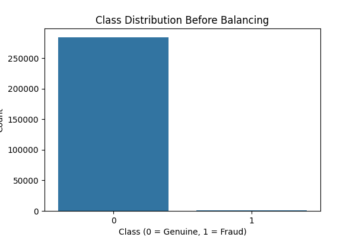
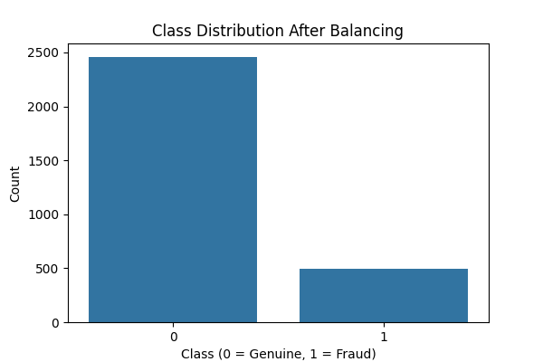
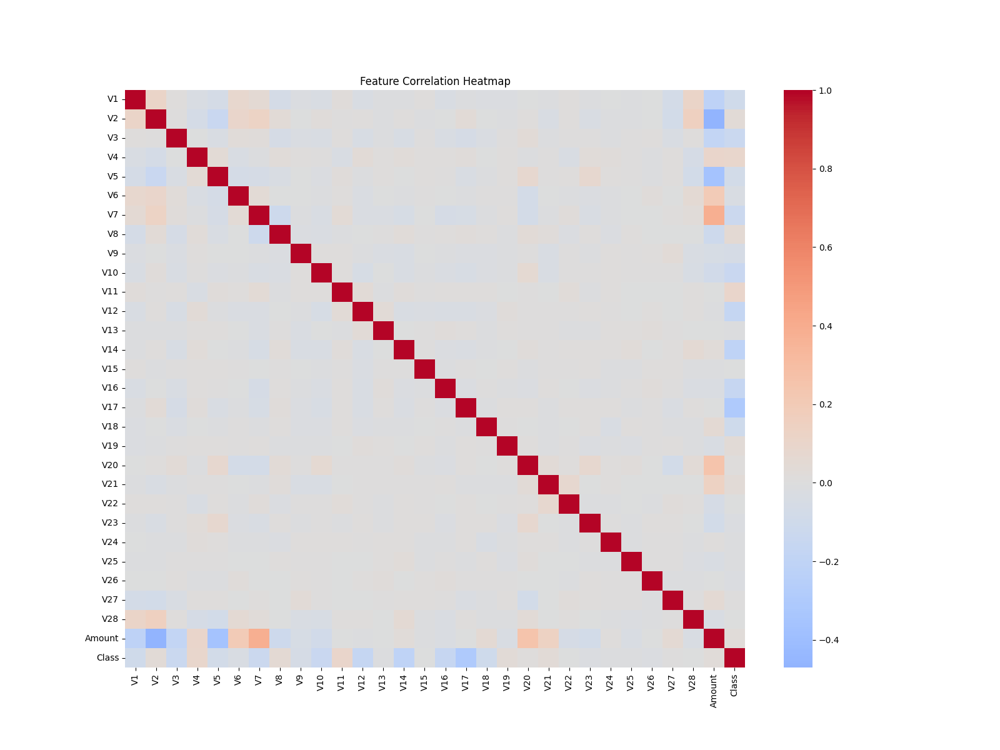
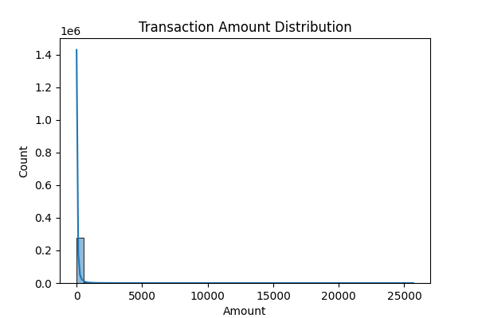

# 💳 Credit Card Fraud Detection

## 📌 Overview

This project builds a **robust machine learning pipeline** to detect fraudulent credit card transactions. It addresses real-world challenges like **data imbalance**, **scalability**, and **interpretability** using a modular, production-grade design.

We use a real anonymized dataset of credit card transactions and classify whether a transaction is **fraudulent (1)** or **genuine (0)**.

---

## 🚀 Features

✅ Class Imbalance Handling (Undersampling)  
✅ Model Options: Logistic Regression / Random Forest  
✅ Clean Modular Structure (Industry Standard)  
✅ Visualizations (Class Distribution, Correlations)  
✅ Evaluation: Precision, Recall, F1-Score  
✅ Logging and CLI Interface  
✅ Ready for Extension (e.g., Streamlit Dashboard, XGBoost)

---

## 🧠 Approach and Rationale

### ⚖️ Problem: Severe Class Imbalance

Only **0.17%** of the data is fraudulent. Standard ML models tend to **ignore minority classes** in such skewed datasets.

### ✅ Solution: Undersampling

Instead of generating synthetic data (`SMOTE`), we used **random undersampling** to reduce the majority class while preserving real fraud patterns. This keeps the data interpretable and compatible with any model.

> 🔍 Why not oversampling?  
> Oversampling introduces synthetic data which can cause **overfitting** or misrepresent real fraud behavior. In production, real patterns matter.

---

## 📂 Project Structure

```
credit_card_fraud_detection/
│
├── data/                   # Contains raw creditcard.csv
├── models/                 # Trained models (.pkl)
├── outputs/                # Logs and saved plots
│   └── plots/              # Visualizations
├── src/                    # Core modules
│   ├── config.py           # Configuration variables
│   ├── preprocess.py       # Data processing & visualizations
│   ├── train.py            # Train model (LogReg or RandomForest)
│   ├── evaluate.py         # Model evaluation
│   └── utils.py            # Logging utilities
├── main.py                 # CLI runner
├── requirements.txt
└── README.md
```

---

## 📊 Visual Insights

### Class Distribution Before Balancing



### Class Distribution After Balancing



### Correlation Heatmap



### Transaction Amount Distribution



---

## 📈 Model Choices

-   **Logistic Regression:** Fast, interpretable baseline
-   **Random Forest:** Non-linear, better at capturing complex fraud patterns

---

## 🛠️ How to Run

### 0. Get the data

-   The size of the data is too large to push to the github so first download the data from kaggel (given at the references). Then extract the zip and put the .csv file directly into the 'data' folder.

### 1. Install dependencies

```bash
pip install -r requirements.txt
```

### 2. Place dataset

Ensure `creditcard.csv` is in the `data/` folder.

### 3. Run training & evaluation

```bash
python main.py --model logreg
# or
python main.py --model rf
```

---

## ✅ Evaluation Results

```text
              precision    recall  f1-score   support

           0     0.9646    0.9893    0.9768       468
           1     0.9550    0.8618    0.9060       123

    accuracy                         0.9628       591
   macro avg     0.9598    0.9256    0.9414       591
weighted avg     0.9626    0.9628    0.9621       591

Confusion Matrix:
 [[463   5]
 [ 17 106]]
```

---

## 📌 Future Improvements

-   ✅ Add XGBoost or LightGBM for better performance
-   ✅ Streamlit UI for real-time scoring
-   ✅ Save confusion matrix and ROC curves
-   ✅ Grid search / Hyperparameter tuning
-   ✅ Pipeline automation with MLflow / DVC

---

## 📚 References

-   [Kaggle Credit Card Fraud Dataset](https://www.kaggle.com/datasets/mlg-ulb/creditcardfraud)
